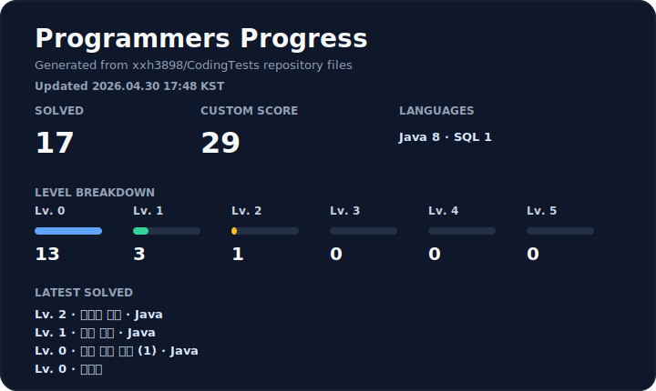

# Coding Test Study

  

  
  
  

## 📚 소개 (Introduction)

이 리포지토리는 **백엔드 개발자**를 목표로 하는 코딩 테스트 학습 기록 공간입니다.
**백준허브(BaekjoonHub)** 를 활용해 백준과 프로그래머스 풀이를 깃허브에 자동으로 저장하고, Java 알고리즘 풀이와 SQL 문제 풀이를 함께 관리합니다.

## 📊 프로그래머스 통계 (Programmers Stats)

프로그래머스 카드는 `프로그래머스/**`에 저장된 풀이 파일을 기준으로 자동 생성됩니다.
표시되는 점수는 프로그래머스 공식 점수가 아니라 레벨별 가중치로 계산한 저장소 기반 custom score입니다.

## 🎯 학습 전략 (Study Roadmap)

### 1. Problem Solving
- **Platforms:** 백준(BOJ), 프로그래머스
- **Languages:** Java, SQL
- **Focus:** 자료구조와 알고리즘 구현력, SQL 문제 해결력을 함께 강화.

### 2. Review Notes
- **Focus:** 풀이 과정에서 배운 핵심 개념, 실수한 지점, 다시 볼 만한 접근법을 정리.
- **Goal:** 문제 풀이 기록을 단순 제출 이력이 아니라 재사용 가능한 학습 자산으로 관리.

### 3. Progress Automation
- **Focus:** 백준허브 자동 커밋과 GitHub Actions 기반 프로그래머스 통계 카드 갱신.
- **Goal:** 풀이 흐름과 진행 현황을 README에서 바로 확인.

## 🗂️ 디렉토리 구조 (Directory Structure)

이 리포지토리는 확장 프로그램에 의해 자동으로 분류됩니다.

### 1. ☕ Baekjoon (`/백준`)
백준에서 푼 문제의 풀이가 난이도별로 자동 저장됩니다.
- 문제 설명이 포함된 `README.md`
- 풀이 코드

### 2. 🐬 Programmers (`/프로그래머스`)
프로그래머스에서 푼 Java/SQL 문제의 풀이가 레벨별로 자동 저장됩니다.
- 문제 설명 (`README.md`)
- 정답 코드 또는 쿼리 (`.java`, `.sql`)

### 3. 📖 학습 노트 (`/Study-Notes`)
문제 해결 과정에서 배운 핵심 로직, 실수한 점(오답 노트), 쿼리 튜닝 과정 등을 직접 정리하는 공간입니다.

## 🚀 문제 풀이 프로세스 (Workflow)

**[Automation]**
1. **백준(BOJ)** 또는 **프로그래머스**에서 문제 풀이 및 제출 (성공 ✅)
2. **BaekjoonHub** 확장 프로그램이 자동으로 해당 플랫폼 폴더에 코드 커밋
3. **GitHub Actions**가 `프로그래머스/**` 폴더를 스캔해 통계 JSON, SVG 카드, Shields endpoint 뱃지를 갱신

**[Manual Review]**
4. `/Study-Notes` 폴더에 핵심 개념 및 회고 작성
5. (SQL 심화) 실행 계획(Explain) 분석이나 쿼리 개선 경험이 있다면 주석으로 남기기

## 🔗 프로필 (Profile)

| 플랫폼 | 내 프로필 |
| :--- | :--- |
| **백준 (BOJ)** | [chiho3898](https://www.acmicpc.net/user/chiho3898) |
| **프로그래머스** | [Link](https://school.programmers.co.kr/) |

---
*This repository is automatically synced with [BaekjoonHub](https://github.com/BaekjoonHub/BaekjoonHub).*
